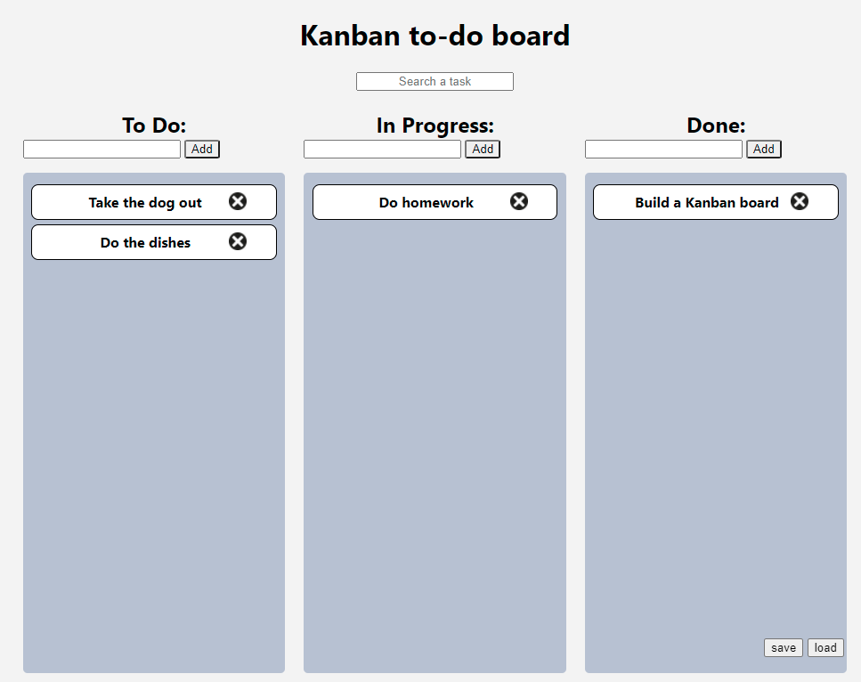

# Or Rosman Pre-Course Final Project

## What the project is about?

In this project I build a "Kanban" style task management board

## Features
- To-Do / In Progress / Done boards
- Search tasks
- Drag & Drop tasks between boards\
  **or**
- Hover the cursor on task and press Alt + 1/2/3 to move task
- Double clicking a task to edit task
- Remove task by clicking on the remove button\
   **or**
- Leave task empty in edit mode
- Save/Load tasks to/from a remote server
